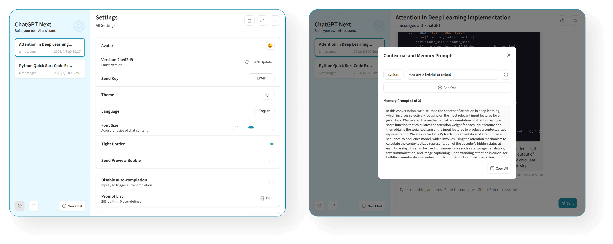

<h1 align="center">NextChat</h1>

English / [简体中文](./README_CN.md)

✨ Light and Fast AI Assistant,with Claude, DeepSeek, GPT4 & Gemini Pro support. 

[![Saas][Saas-image]][saas-url]
[![Web][Web-image]][web-url]
[![Windows][Windows-image]][download-url]
[![MacOS][MacOS-image]][download-url]
[![Linux][Linux-image]][download-url]

[NextChatAI](https://nextchat.club?utm_source=readme) / [iOS APP](https://apps.apple.com/us/app/nextchat-ai/id6743085599) / [Web App Demo](https://app.nextchat.dev) / [Desktop App](https://github.com/Yidadaa/ChatGPT-Next-Web/releases) / [Enterprise Edition](#enterprise-edition) 

[saas-url]: https://nextchat.club?utm_source=readme
[saas-image]: https://img.shields.io/badge/NextChat-Saas-green?logo=microsoftedge
[web-url]: https://app.nextchat.dev/
[download-url]: https://github.com/Yidadaa/ChatGPT-Next-Web/releases
[Web-image]: https://img.shields.io/badge/Web-PWA-orange?logo=microsoftedge
[Windows-image]: https://img.shields.io/badge/-Windows-blue?logo=windows
[MacOS-image]: https://img.shields.io/badge/-MacOS-black?logo=apple
[Linux-image]: https://img.shields.io/badge/-Linux-333?logo=ubuntu

    

## 🥳 Cheer for NextChat iOS Version Online!

 
## 🫣 NextChat Support MCP  ! 
> Before build, please set env ENABLE_MCP=true

## Screenshots

   

